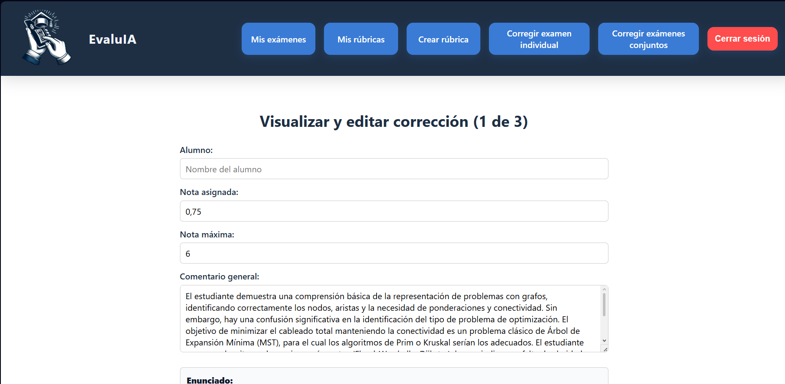

# EvaluIA (FastAPI + React + MongoDB + Docker)

Aplicación web para evaluación automática de exámenes asistida por LLM, con generación de feedback a partir de rúbricas (opcional). Integra un flujo completo desde la subida de entregas (PDF/archivos) y la definición de criterios, hasta la evaluación, el reporte de resultados y la exportación/consulta posterior para revisión. 

El objetivo del proyecto es agilizar la corrección y estandarizar criterios de evaluación, manteniendo trazabilidad de resultados y feedback (según configuración del docente). Está orientado como proyecto de TFG para demostrar una arquitectura full‑stack (FastAPI + React + MongoDB + Docker) e integración con un proveedor LLM (p. ej., Gemini) de forma configurable. 

## Arquitectura

El proyecto está dividido en los siguientes componentes principales:

- Backend: API REST con FastAPI (gestiona lógica de negocio, evaluación y persistencia).
- Frontend: React (interfaz para subir documentos, gestionar rúbricas y revisar resultados).
- Base de datos: MongoDB (almacén de rúbricas, exámenes, resultados, etc.).
- LLM provider: integración vía API (por ejemplo, Google Gemini).
- Infra: Docker / Docker Compose para desarrollo y despliegue local.

## Vista rápida




Más capturas: [docs/img/](docs/img/)

## Tecnologías

- Backend: Python + FastAPI (+ Uvicorn).
- Frontend: React 
- Base de datos: MongoDB.
- Infra/DevOps: Docker, Docker Compose.
- LLM: Google Gemini API 

## Cómo ejecutar

## Cómo ejecutar

### Con Docker (recomendado)

1) Crea tu archivo de entorno:

```bash
cp .env.example .env
```

2) Levanta el stack:
  ```bash
    docker compose up --build
  ```
3)Abre la app:

Frontend: http://localhost:3000

### En local (sin Docker)
Backend:
```bash
cd backend
python -m venv .venv
# Windows: .venv\Scripts\activate
source .venv/bin/activate
pip install -r requirements.txt
uvicorn app.main:app --reload --host 0.0.0.0 --port 8000
```

Frotend: 
```bash
cd frontend
npm install
npm run dev
```
 
Importante (modo local): si ejecutas el proyecto **sin Docker**, necesitas tener MongoDB disponible (local o remoto) y configurar la variable `MONGO_URI` en tu `.env`.
